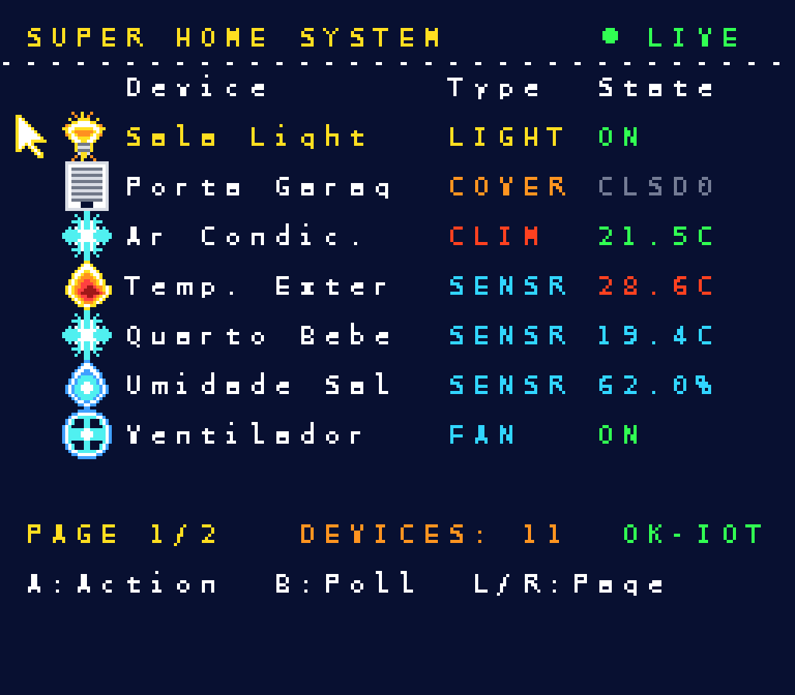
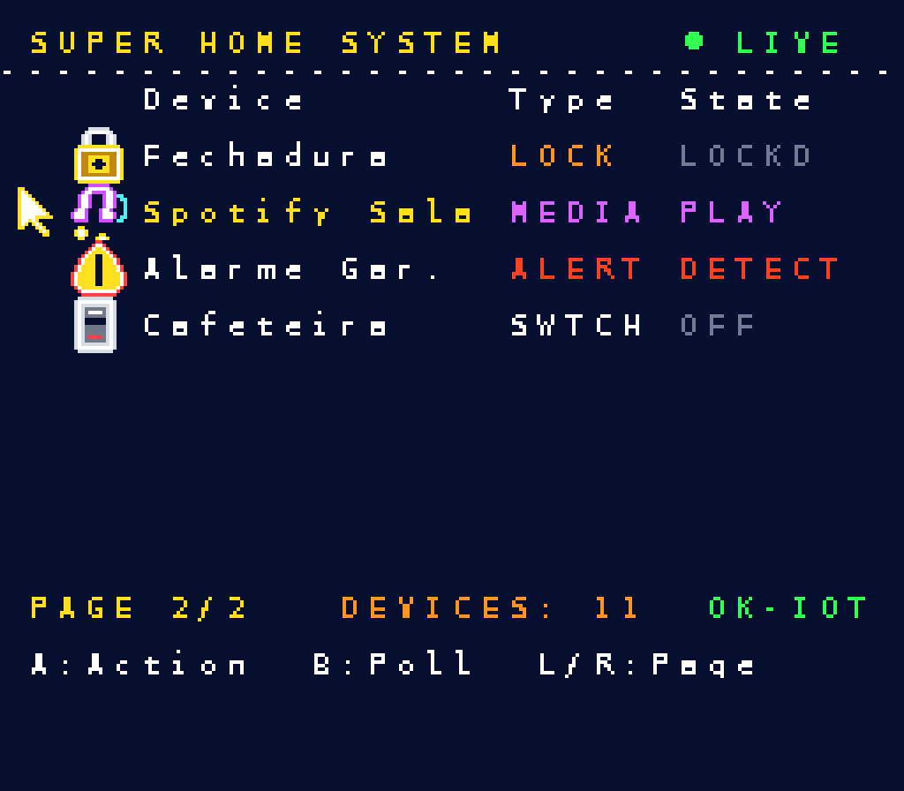
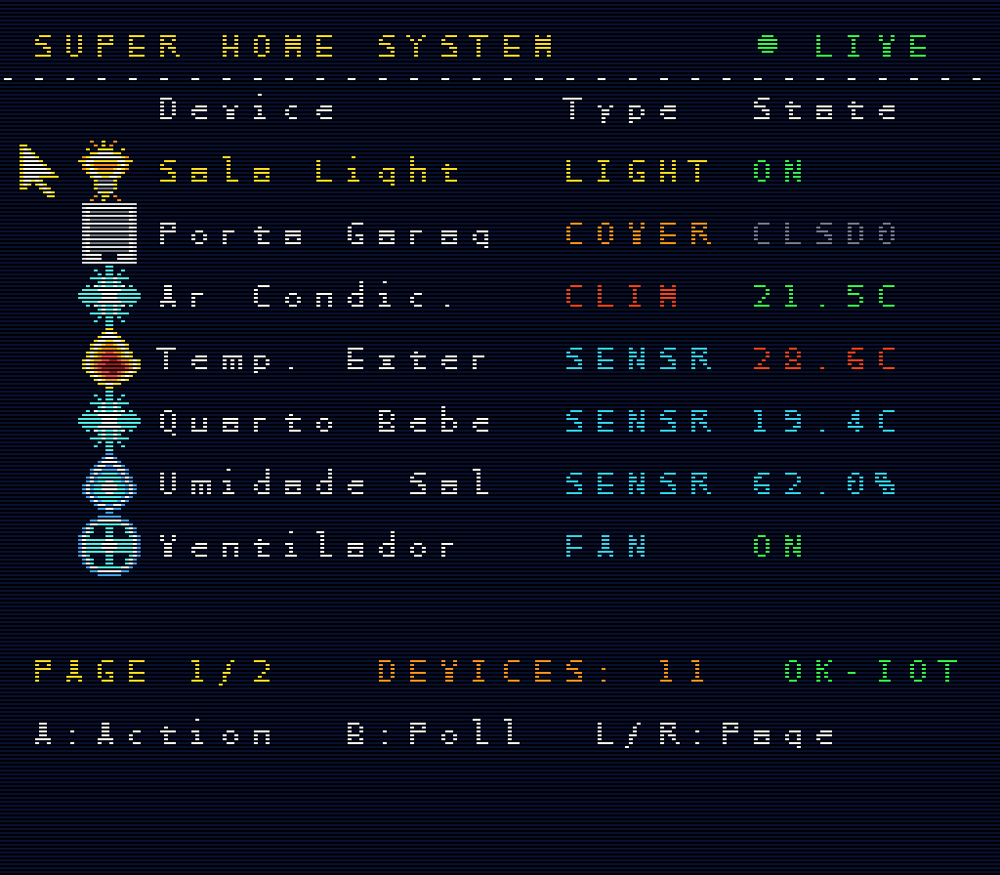

# Super Famicom / SNES Smart Home & Diagnostics Cartridge V1.0

Custom smart cartridge for the **Super Famicom / SNES (SHVC-001)** console with bidirectional **Home Assistant** integration, bench telemetry, Wi-Fi 6 / BLE / Thread connectivity, and industrial expansion bus.

Designed to run on real hardware and emulators, with a 100% data-driven architecture: **the ROM does not assume beforehand how many or what devices exist in the house**.

---

## 📷 Photos and ROM Screenshots on Super Nintendo

| Page 1: Lighting, Garage, Climate and Fan | Page 2: Lock, Spotify, Alarm and Switch |
|:---:|:---:|
|  |  |

### Retro Arcade CRT Simulation (Scanlines & PVM Phosphor)


---

## 1. System Architecture

```text
       ┌────────────────────────┐
       │     Home Assistant     │ (Server / Home)
       └───────────┬────────────┘
                   │ REST (GET /api/states) / WebSocket (state_changed)
                   ▼
       ┌────────────────────────┐
       │   Python Bridge / LAN  │ (Domain translation and normalization)
       └───────────┬────────────┘
                   │ Wi-Fi 802.11ax / TCP / Compact protocol 'SH 01'
                   ▼
┌───────────────────────────────────────────────────────────────┐
│              PHYSICAL SUPER FAMICOM / SNES CARTRIDGE           │
│                                                               │
│   ┌────────────────────┐          ┌───────────────────────┐   │
│   │   ESP32-C6-MINI    │◄─SPI/UART─┤        RP2350B        │   │
│   │ (Wi-Fi 6 / Thread) │          │  (Dual M33, 520KB)    │   │
│   └────────────────────┘          │  Mailbox in SRAM      │   │
│                                   └───────────┬───────────┘   │
│                                               │               │
│   ┌────────────────────┐          ┌───────────▼───────────┐   │
│   │   SST39VF040       │          │   74LVC Shifters      │   │
│   │  (Flash Boot ROM)  │          │   (5V TTL ◄─► 3.3V)   │   │
│   └─────────┬──────────┘          └───────────┬───────────┘   │
│             │                                 │               │
└─────────────┼─────────────────────────────────┼───────────────┘
              ▼                                 ▼
       ┌────────────────────────────────────────────────────────┐
       │                SNES 62-Pin Cartridge Bus               │
       │   (W65C816S CPU @ 3.58MHz, PPU Mode 1, OAM Sprites)    │
       └────────────────────────────────────────────────────────┘
```

### Architecture Principles
1. **Complexity Isolation:** The SNES does not process JSON, TLS, Wi-Fi, or HTTP. The ESP32-C6 handles all networking and security; the RP2350B normalizes state into a memory-mapped buffer (SRAM / Mailbox); the SNES only reads clean binary data.
2. **Dynamic Interface:** Layout is calculated at runtime. If you add 10 lights in Home Assistant, the SNES screen automatically creates new rows and pages. If you remove an outlet, it disappears from the ROM without recompiling the game.
3. **Instant Boot:** The parallel NOR Flash (512 KB) ensures immediate boot on the console (< 50 ms), while the coprocessors bring up networking in the background.

---

## 2. Repository Structure

```text
snes-smart-home/
├── snes/                      # SNES ROM source code (C + 65816 Assembly)
│   ├── src/
│   │   ├── main.c             # Main game loop and vblank (C)
│   │   ├── ui.c               # Screen rendering, 8 CGRAM palettes, pagination and sprites (C)
│   │   ├── ui.h
│   │   ├── audio.c            # SPC700 sound driver (C)
│   │   ├── audio.h
│   │   ├── cart_hw.asm        # Low-level bus driver in pure 65816 Assembly
│   │   ├── cart_hw.h          # C header for ASM routine calls
│   │   ├── cartio.c           # Cartridge I/O (SRAM mailbox + sim fallback) (C)
│   │   ├── cartio.h
│   │   └── config.h           # Display settings, limits, and SIMULATOR fallback
│   ├── assets/                # Converted bitmaps (font and icons)
│   │   ├── font.bmp           # 8x8 bitmap font
│   │   ├── icons.bmp          # 20 16x16 sprites for domains (light, door, fan, etc.)
│   │   └── make_icons.py      # Procedural generator for the 16x320 sprite sheet
│   ├── res/                   # Audio resources for smconv
│   │   └── soundbank.it       # ImpulseTracker tracker with samples and SFX
│   ├── data.asm               # Graphic data inclusion in ROM (WLA-DX)
│   ├── Makefile               # PVSnesLib 4.6.0 build script with smconv
│   └── super_home.sfc         # Compiled 256 KB ROM (LoROM SlowROM)
│
├── firmware/                  # Cartridge Coprocessor Firmware
│   ├── esp32/                 # Wi-Fi 6 / Thread Gateway (C / ESP-IDF)
│   │   ├── main/main.c        # Home Assistant REST Client + SPI Master
│   │   └── CMakeLists.txt
│   └── rp2350/                # SNES 62-pin Bus Emulator (C + PIO Assembly)
│       ├── main.c             # Dual-Core M33 Management and SRAM Mailbox
│       ├── snes_bus.pio       # PIO state machine for /RD and /WR cycles (<120ns)
│       └── CMakeLists.txt
│
├── hardware/                  # Complete KiCad 10 Electronic Design
│   ├── snes_smarthome_cartridge.kicad_pro   # KiCad Project
│   ├── snes_smarthome_cartridge.kicad_sch   # Root Schematic
│   ├── 01_SNES_BUS_AND_CIC.kicad_sch        # 62-pin connector + SuperCIC
│   ├── 02_LEVEL_SHIFTERS_AND_FLASH.kicad_sch# 5V<->3.3V Shifters + Boot Flash
│   ├── 03_RP2350_SUBSYSTEM.kicad_sch        # RP2350B MCU, QSPI 16MB, USB-C
│   ├── 04_ESP32C6_WIFI_IOT.kicad_sch        # ESP32-C6-MINI, Wi-Fi 6, RGB LED
│   ├── 05_PERIPHERALS_AND_POWER.kicad_sch   # MicroSD, RTC DS3231, RS485, Buck
│   ├── snes_smarthome_schematics.pdf        # Complete multi-sheet PDF
│   ├── BOM.md                               # Detailed Bill of Materials
│   ├── BOM.csv                              # BOM formatted with LCSC codes
│   └── PCBWAY_SPECS.md                      # PCBWay manufacturing rules
│
├── bridge/                    # Python Bridge (Home Assistant <-> Cartridge)
│   ├── ha_bridge.py           # REST polling, HTTP server, and TCP socket
│   └── requirements.txt
│
├── tests/                     # Automated Test Suite (Python)
│   └── test_system.py         # ROM integrity, protocol, and mailbox tests
│
├── docs/                      # Test documentation, captures, and architecture
│   ├── screenshots/           # High-resolution photos and screen captures
│   ├── architecture.md
│   ├── pin-mapping.md         # Complete pin mapping and signaling
│   └── test-plan.md
│
├── scripts/                   # Rendering and build utilities
│   └── generate_screenshots.py# Pixel-perfect and CRT screenshot generator
│
├── build-rom.sh               # ROM build script (1 click)
├── docker-compose.yml         # Local environment with Home Assistant + Bridge
└── README.md                  # This document
```

---

## 3. How to Compile the SNES ROM

### Prerequisites
- Linux x86_64 with `make` and `gcc`.
- **PVSnesLib 4.6.0** (installed in `/home/forg3/tools/pvsneslib` or configured via `PVSNESLIB_HOME`).

### Compilation
```bash
./build-rom.sh
```
The script will compile the graphic assets (`gfx4snes`), the C code (`816-tcc`), the assembler (`wla-65816`), run instruction optimization (`816-opt`), and generate the ROM at:
```text
snes/super_home.sfc
```

### Running in an Emulator
The ROM can be opened in any standard emulator (**bsnes**, **snes9x**, **Mesen 2**):
```bash
flatpak run com.snes9x.Snes9x snes/super_home.sfc
# or
flatpak run dev.bsnes.bsnes snes/super_home.sfc
```
In an emulator without the physical RP2350 hardware connected, the cartridge detects the absence of the `SH 01` signature at the SRAM address and activates **SIMULATOR** mode, allowing page navigation with `L` and `R`, entity selection with the D-pad, and state toggling with the `A` button.

### ROM Audiovisual Features

#### 1. Pixel Art Sprites and Animations (16×16 OAM)
The sprite sheet contains 20 themed icons (`snes/assets/icons.bmp` generated via `make_icons.py`):
- **Light (`light`):** Off incandescent bulb vs. on with golden radiant rays.
- **Switch (`switch`):** Industrial rocker switch with green LED indicator.
- **Garage / Gate (`cover`):** Closed gate vs. open with stylized retro sports car.
- **Lock (`lock`):** Closed padlock (locked) vs. open shackle (unlocked).
- **Fan (`fan`):** 4-blade propeller that **spins in real time**, alternating between 0° and 45° when powered on.
- **Climate (`climate`):** Snowflake for cooling / cold vs. orange flame for heating (> 24°C).
- **Sensors (`sensor`):** Blue droplet for humidity (%) vs. power bolt for watts/volts vs. thermometer.
- **Security (`binary_sensor`):** Green shield in safe state vs. warning triangle on alert.
- **Media (`media_player`):** Speaker in pause vs. equalizer with musical notes when playing.
- **Dynamic Cursor:** Indicator arrow with 2-frame animation and sinusoidal bounce effect to the left of the selected device.

#### 2. SPC700 Sound Effects (Sony DSP)
The cartridge integrates a Tracker soundbank (`snes/res/soundbank.it` compiled via `smconv` in ROM bank 5):
- `UP` / `DOWN`: Crisp percussive marimba when moving the cursor.
- `L` / `R`: Tactile acoustic click when changing pages.
- `A` (Turn On): Ascending melodic chime when activating/opening a device.
- `A` (Turn Off): Low-tone tap when deactivating/closing.
- `B` (Polling): Soft Home Assistant synchronization chime.

#### 3. Colored Text Palettes (BG Mode 1 - 8 CGRAM Palettes)
Device texts receive semantic colors based on type and state:
- **Gold (`PAL_GOLD`):** Main title, selected item, and page indicator.
- **Electric Cyan (`PAL_CYAN`):** Cold temperature (< 21°C) and humidity (%).
- **Fire Orange (`PAL_ORANGE`):** Hot temperature (> 25°C) and sensor alerts.
- **Emerald Green (`PAL_GREEN`):** States `"ON"`, `"OPEN"`, `"UNLKD"` and thermal comfort (21°C to 25°C).
- **Neutral Gray (`PAL_GRAY`):** Off states (`"OFF"`, `"CLSD"`, `"LOCKD"`).
- **Neon Purple (`PAL_PURPLE`):** Media devices (`"PLAY"`).
- **Amber (`PAL_AMBER`):** Device counters and warnings.

### ROM Architecture (C + Pure 65816 Assembly)
The ROM uses a hybrid high-level and low-level structure:
- **C (`816-tcc`):** GUI management, dynamic pagination, animations, font rendering, and state machines (`snes/src/main.c`, `snes/src/ui.c`, `snes/src/audio.c`).
- **Pure 65816 Assembly (`wla-65816`):** The [`snes/src/cart_hw.asm`](snes/src/cart_hw.asm) module implements low-level routines with 24-bit long addressing (`$700000` to `$7007FF`):
  - `cart_hw_probe()`: Atomic probe of the `'S', 'H', 0x01` signature on the cartridge SRAM bus.
  - `cart_hw_send_cmd()`: Atomic write to RP2350 command registers (`0x07F0..0x07F3`) with memory barrier and handshake flag.
  - `data.asm`: Graphic data bank allocation in `.rodata1`.

### Coprocessor Firmware
To ensure communication without overloading the SNES CPU, the cartridge features dedicated coprocessors:
1. **ESP32-C6 (`firmware/esp32/` - C / ESP-IDF):**
   - Connects to the Wi-Fi 6 (802.11ax) network.
   - Polls the Home Assistant Bridge (`/snapshot.bin`) or subscribes to TCP streams.
   - Validates integrity via CRC16 Modbus.
   - Sends snapshots and receives commands from the SNES via SPI bus at 10 MHz.
2. **RP2350B (`firmware/rp2350/` - C + PIO Assembly):**
   - **Core 0 + PIO (`snes_bus.pio`):** Emulates dual-port SRAM responding to SNES 62-pin bus `/RD` and `/WR` cycles in under 120 ns.
   - **Core 1:** Synchronizes buffers with the ESP32 via SPI and dispatches commands generated by the player.

### Automated ROM and Protocol Tests
The repository includes a complete automated test suite in Python:
```bash
python3 -m unittest discover -s tests -p "test_*.py" -v
```
The tests cover:
- Binary integrity of the 256 KB ROM and LoROM header checksum complement calculation.
- Serialization and deserialization of the compact binary protocol (`SH\x01`) and CRC16/Modbus (`0xA001`) algorithm validation.
- Home Assistant domain and service mapping and normalization.
- Alignment of command register offsets in cartridge memory.

---

## 4. Hardware and Specifications for PCBWay

The complete schematic was developed and validated with **KiCad 10.0.6** (`0 ERC violations`).

### Critical Fabrication Rules (PCBWay / JLCPCB)
When submitting files for manufacturing, you must select:
1. **Board Thickness: 1.2 mm** (The Super Famicom female connector was designed for 1.2 mm. 1.6 mm boards damage and warp the console's contact pins.)
2. **Edge Pitch: 2.50 mm Metric** (Do not use 2.54 mm / 0.1", as the cumulative error across 31 pins causes short circuits.)
3. **Gold Fingers with 30° Bevel (30° Edge Beveling):** Essential for the board to slide smoothly into the slot without damaging the gold contacts.
4. **Surface Finish:** **ENIG** (Electroless Nickel Immersion Gold) or **Hard Gold** on edge contacts.
5. **Layer Count: 4 Layers** (Top: Signals and RF Antenna / In1: Solid GND / In2: 3.3V and 5V / Bottom: Signals and back bus).

### Bill of Materials and LCSC Codes
The component list includes codes ready for turnkey SMT assembly:
- **RP2350B:** Dual Cortex-M33, 520KB SRAM, 48 GPIOs (QFN-80)
- **W25Q128JVSIQ:** 16MB QSPI Flash ([C97521](https://www.lcsc.com/product-detail/NOR-Flash_Winbond-Elec-W25Q128JVSIQ_C97521.html))
- **ESP32-C6-MINI-1-N4:** Wi-Fi 6 + BLE 5 + Thread ([C5248554](https://www.lcsc.com/product-detail/WiFi-Modules_Espressif-Systems-ESP32-C6-MINI-1-N4_C5248554.html))
- **SST39VF040-70-4C-WHE:** 512KB Parallel Boot ROM ([C129525](https://www.lcsc.com/product-detail/NOR-Flash_Microchip-Tech-SST39VF040-70-4C-WHE_C129525.html))
- **74LVC541APW:** 5V -> 3.3V Buffer ([C5975](https://www.lcsc.com/product-detail/Buffers-Drivers-Receivers-Transceivers_Nexperia-74LVC541APW-118_C5975.html))
- **SN74LVC8T245PWR:** 5V <-> 3.3V Data Transceiver ([C6207](https://www.lcsc.com/product-detail/Buffers-Drivers-Receivers-Transceivers_Texas-Instruments-SN74LVC8T245PWR_C6207.html))
- **PIC12F629-I/SN:** SuperCIC Lockout Bypass ([C20967](https://www.lcsc.com/product-detail/Microcontroller-Units-MCUs-MPUs-SOCs_Microchip-Tech-PIC12F629-I-SN_C20967.html))
- **SY8089AAAC:** 5V -> 3.3V 2A Synchronous Buck ([C28674](https://www.lcsc.com/product-detail/DC-DC-Converters_Silergy-Corp-SY8089AAAC_C28674.html))
- **DS3231MZ+:** High-precision MEMS RTC ([C16719](https://www.lcsc.com/product-detail/Real-Time-Clocks-RTC_Analog-Devices-Maxim-Integrated-DS3231MZ_C16719.html))
- **SP3485CN-L/TR:** 3.3V RS-485 Transceiver ([C6960](https://www.lcsc.com/product-detail/RS-485-RS-422-ICs_MaxLinear-SP3485CN-L-TR_C6960.html))

*See [`hardware/BOM.md`](hardware/BOM.md) and [`hardware/BOM.csv`](hardware/BOM.csv) for the full list.*

---

## 5. Compact Binary Protocol (V1)

The cartridge communicates with the bridge using compact frames with checksum:

```text
[Header 2B: 'S' 'H'] [Version: 0x01] [Total Entities: 1B] [Entity Records...] [CRC16/Modbus 2B]
```

### Each Entity Format:
```text
u8  domain               (1: light, 2: switch, 3: cover, 4: lock, 5: fan, 6: climate, 7: sensor...)
u8  state_code           (0: off/closed, 1: on/open, 2: numeric value / other)
u8  features             (capability bitmask: on/off, brightness, temperature, percentage)
u8  name_len             (friendly name length in characters)
u16 numeric_value_x100   (value multiplied by 100 in little-endian, or 0xFFFF if null)
u8  name[name_len]       (ASCII string of the name)
```

### Command Mailbox (SNES -> RP2350 -> Home Assistant):
- `0x07F0`: Command code (`1`: Toggle ON/OFF, `2`: Open/Close Cover)
- `0x07F1`: Target entity index
- `0x07F2`: Parameter / New state
- `0x07F3`: Handshake flag (SNES writes `0x01`; RP2350 clears to `0x00` after dispatching via ESP32)

---

## 6. Testing with Home Assistant

1. Start the test environment:
   ```bash
   podman compose up -d homeassistant
   # or
   docker compose up -d homeassistant
   ```
2. Obtain a long-lived access token in Home Assistant (`http://127.0.0.1:8123`).
3. Export the token and start the bridge:
   ```bash
   export HA_TOKEN="your_token_here"
   python3 bridge/ha_bridge.py
   ```
4. Query the generated snapshot:
   ```bash
   curl http://127.0.0.1:8790/entities
   curl http://127.0.0.1:8790/snapshot.bin --output snap.bin
   ```
5. Send a test command:
   ```bash
   curl -X POST http://127.0.0.1:8790/command \
     -H "Content-Type: application/json" \
     -d '{"entity_id":"light.sala_light","action":"off"}'
   ```
